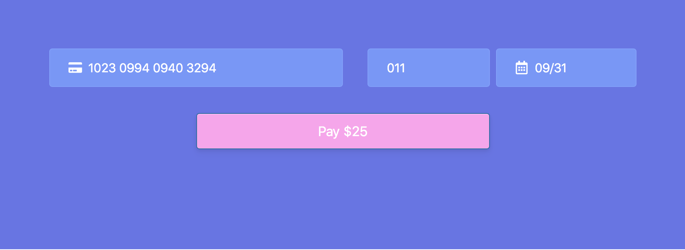

# react-authorize-net





Modern react integration layer for the [Accept.js](https://developer.authorize.net/api/reference/features/acceptjs.html) library.


## Why

Integrating the [Authorize.Net](https://www.authorize.net/) platform with a modern web application can be painful.

Their whole platform is very unfriendly to SPAs and even more so to the beautiful programming model offered by React.

The main goal of this library is to abstract some of this pain away.

## Features

- Modern idiomatic React interface to Accept.js
- Small API surface
- Fully typed interface (using TypeScript)
- Quick and easy integration in any modern React stack
- Elegant and beautiful form UX available by default
- Simple authentication with Authorize.Net platform
- Easy validation of user input

## Installation

### ES Module

```
npm install --save react-authorize-net
```

## API

### \<FormContainer />

This component can be used to easily implement and integrate a payment form in a React application.

#### Props

##### clientKey

`string`

Your [Authorize.Net Client Key](https://developer.authorize.net/api/reference/features/acceptjs.html#Generating_and_Using_the_Public_Client_Key).

##### apiLoginId

`string`

Your [Authorize.Net API Login ID](https://support.authorize.net/s/article/How-do-I-obtain-my-API-Login-ID-and-Transaction-Key).

##### amount

`number`

The amount of money that is being charged by the payment form.  

##### environment

`"sandbox" | "production"`

Which underlying Accept.js library to use.

> The libaries are unique to both Authorize.Net environments (production and sandbox), so it is important to load the sandbox library if you are testing transactions, and to use the production library for live transaction processing, as shown below.

##### onSuccess

`(response: Accept.Response) => void`

Function called on successful reception of payment nonce.

##### onError

`(errors: string[]) => void`

Function called on failed form submission.

##### render

`FormContainer` expect a function returning some React elements (a component) passed in the `render` prop. This should allow for maximum flexibility during the implementation of your payment form UX.

This function will be called with an object containing the following properties:

###### values

`{ cardCode: string, cardNumber: string, expDate: string }`

`values` represents the values backing your underlying input elements.

###### handleChange

`(keyof FormType, React.ChangeEvent<any>) => React.ChangeEvent<any>`

`handleChange` is the callback used to notify `FormContainer` about changes to the raw values backing your form inputs.

###### validationErrors

`{ cardCode: boolean, cardNumber: boolean, expDate: boolean }`

`validationErrors` is an object used to represent any invalid state (invalid user input) present in your payment form.

The validation is made according to the shape of data that Authorize.Net API is expecting.

###### apiErrors

`[]string`

`apiErrors` represents any errors that Authorize.Net API might return while making the underlying API request.

## How to use

### Code sample

You can use this [repo](https://github.com/j-em/react-authorize-net-example) as a reference point on how to integrate the library in an existing React application.
